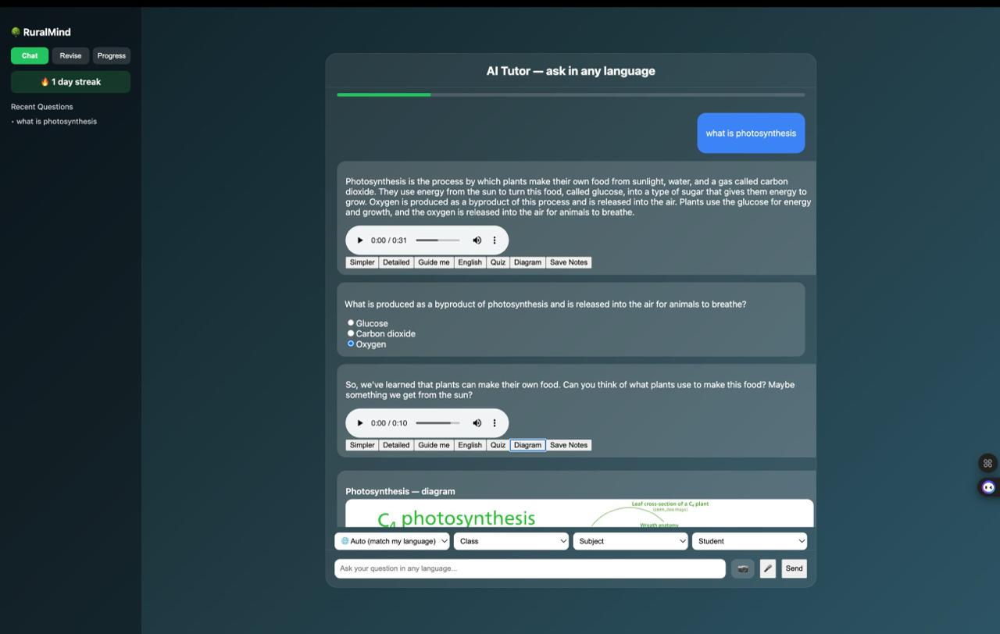
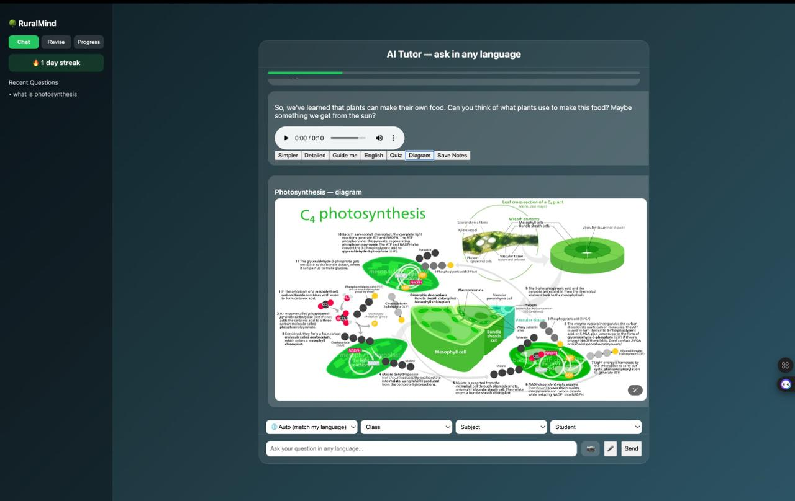
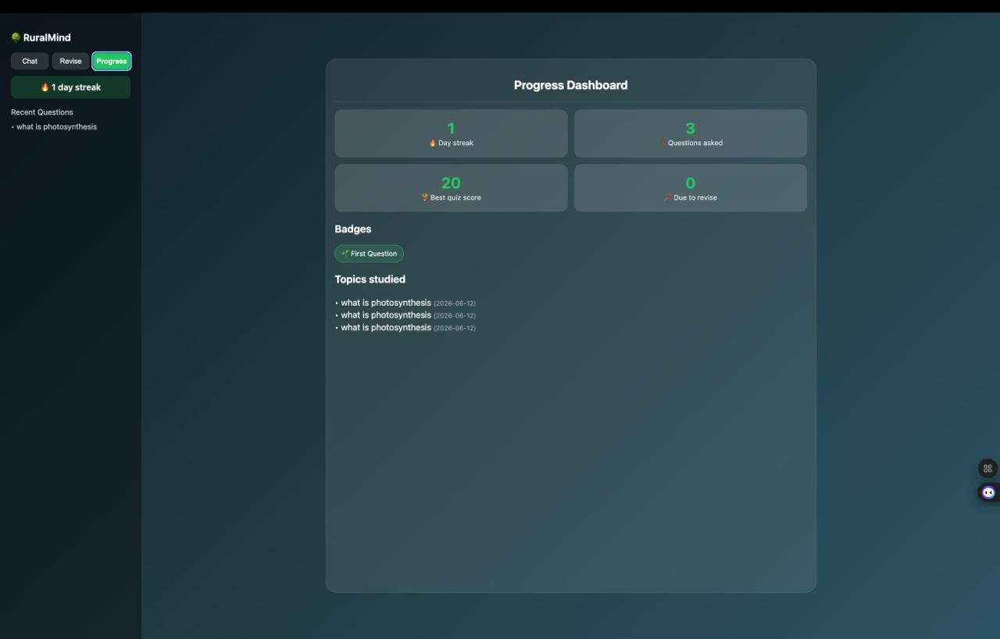

# 🌳 RuralMind — Multilingual AI Tutor

**Learn in your language. Grow without limits.**

RuralMind is an AI-powered tutor built for students in rural areas, where a child's
biggest barrier often isn't ability — it's language. Ask a question in **Hindi,
Tamil, Telugu, Hinglish, Tanglish, or plain English**, and RuralMind answers back
in that same language, with voice, diagrams, quizzes, and progress tracking.

---

## 📸 Screenshots

| Ask in any language | Real labeled diagrams | Track your progress |
|---|---|---|
|  |  |  |

---

## ✨ Features

- **Truly multilingual** — ask in any language or script (including romanized
  Hinglish like *"barish kaise hoti hai"* and Tanglish like *"force na enna"*) and
  get the answer in that same language. A "🌐 Auto" mode mirrors whatever you type,
  or you can **force** a specific reply language (e.g. always answer in Telugu).
- **Voice everywhere** — speak your question (mic adapts to the chosen language) and
  listen to the answer read aloud.
- **Answer styles** — *Kid*, *Student*, *Detailed* (full tutor-style explanation),
  *Exam*, and *Guide me* (Socratic hints instead of the answer).
- **English on demand** — one tap translates any answer into English to study
  bilingually.
- **Photo question solver** — snap a photo of a textbook question; OCR reads it
  (English + Hindi + Tamil) and turns it into a question.
- **Real labeled diagrams** — fetches actual science diagrams from Wikimedia
  Commons (with a Google Image Search fallback).
- **Quizzes** — auto-generated MCQs in the student's language, with scoring.
- **Save notes** — export a printable worksheet (answer + practice questions).
- **Progress & motivation** — daily streaks, badges, a spaced-repetition revision
  queue, and a progress dashboard (doubles as a parent/teacher view).
- **Works offline-first (PWA)** — installable, and the app shell loads without
  internet. (AI answers still need the local server running.)

---

## 🛠️ Tech Stack

| Layer       | Tech |
|-------------|------|
| Frontend    | React + Vite, PWA (service worker + manifest) |
| Backend     | FastAPI (Python) |
| AI model    | Ollama running **llama3** (local) |
| Retrieval   | FAISS + sentence-transformers over NCERT science PDFs (RAG) |
| Language    | langdetect + custom romanized-language detection, deep-translator |
| Voice       | gTTS (text-to-speech), Web Speech API (speech-to-text) |
| OCR         | Tesseract (pytesseract) |
| Diagrams    | Wikimedia Commons API, Google Custom Search (optional) |

---

## 📋 Requirements

Install this system software **before** the project itself:

| Software | Version | What it's for | Install |
|----------|---------|---------------|---------|
| **Python** | 3.10+ | Backend (FastAPI) | [python.org](https://www.python.org/downloads/) |
| **Node.js** | 18+ | Frontend (React/Vite) | [nodejs.org](https://nodejs.org/) |
| **Ollama** | latest | Runs the local AI model | [ollama.com](https://ollama.com) |
| **llama3** | — | The AI model itself | `ollama pull llama3` |
| **Tesseract** | 5+ | Photo/OCR feature *(optional)* | see below |

### Install Ollama + the model

```bash
# after installing Ollama from ollama.com:
ollama pull llama3
ollama run llama3        # keep this running while you use the app
```

### Install Tesseract (only needed for the 📷 photo feature)

```bash
# macOS
brew install tesseract tesseract-lang

# Ubuntu / Debian
sudo apt install tesseract-ocr tesseract-ocr-hin tesseract-ocr-tam

# Windows
# Download the installer from https://github.com/UB-Mannheim/tesseract/wiki
# and tick the Hindi/Tamil language packs during install.
```

### Python packages (installed automatically via requirements.txt)

`fastapi`, `uvicorn`, `requests`, `langdetect`, `gTTS`, `deep-translator`,
`sentence-transformers`, `faiss-cpu`, `numpy`, `pypdf`, `python-multipart`,
`pytesseract`, `Pillow`, `python-dotenv`

### Node packages (installed automatically via npm install)

`react`, `react-dom`, `reactflow`

---

## 🚀 Getting Started

> Make sure `ollama run llama3` is running in its own terminal first.

### 1. Backend

```bash
cd Backend
python3 -m venv venv            # create a virtual environment
source venv/bin/activate        # Windows: venv\Scripts\activate
pip install -r requirements.txt # install all Python packages
uvicorn main:app --reload       # start the API
```

The API runs at `http://127.0.0.1:8000`.

> **Optional:** copy `.env.example` to `.env` and add a Google Custom Search key to
> enable the Google image fallback for diagrams. Without it, diagrams still work via
> Wikimedia (no key needed).

### 2. Frontend (in a second terminal)

```bash
cd Frontend
npm install        # install all Node packages
npm run dev        # start the app
```

Open the URL Vite prints (usually `http://localhost:5173`).

### ✅ You should now have three things running

1. `ollama run llama3` — the AI model
2. `uvicorn main:app --reload` — the backend (port 8000)
3. `npm run dev` — the frontend (port 5173)

### Quick troubleshooting

- **Answers say "explanation could not be generated"** → Ollama/llama3 isn't running.
- **Forced language or English button does nothing** → these need internet (they use
  Google Translate); on "🌐 Auto" with English/Hinglish/Tanglish no internet is needed.
- **📷 photo button errors** → Tesseract isn't installed (see above).
- **Diagrams show plain boxes** → both image sources returned nothing; usually a
  network issue or an exhausted Google quota.

---

## 🌐 How the language handling works

- **Native scripts** (Devanagari, Tamil, Telugu…) are detected with `langdetect`.
- **Romanized Indian languages** (Hinglish/Tanglish) are caught by a keyword
  heuristic, since standard detectors mistake them for Swahili/Danish/etc.
- **Forced languages** generate the answer and then translate it (llama3 alone is
  unreliable for many Indian languages), guaranteeing correct output.
- Answers, voice, and quizzes all stay in one consistent language.

---

## 🗺️ Roadmap

- Web-source RAG (pull fresh content from Wikipedia / NCERT on demand)
- Offline diagram caching
- Multi-user accounts + a real teacher dashboard
- Stronger offline multilingual model (e.g. IndicTrans)
---

## 📄 License

For educational use. Add a license of your choice (e.g. MIT) if you plan to
distribute.
